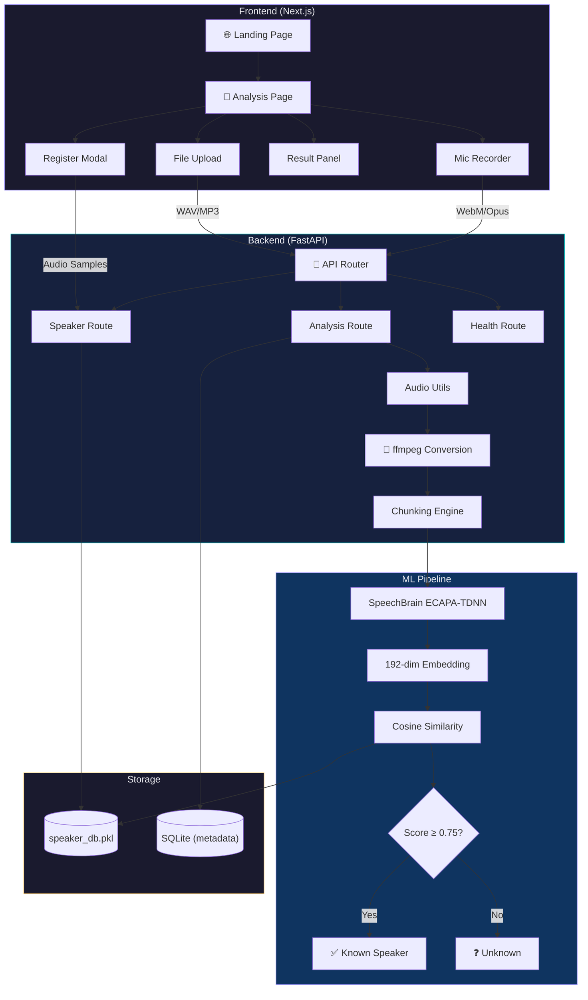
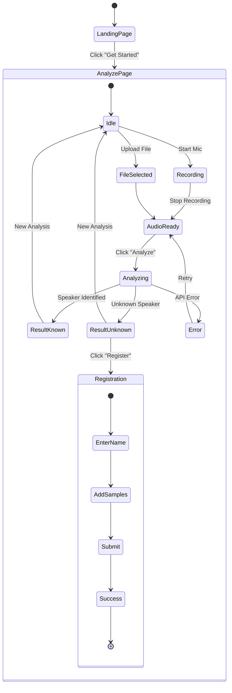
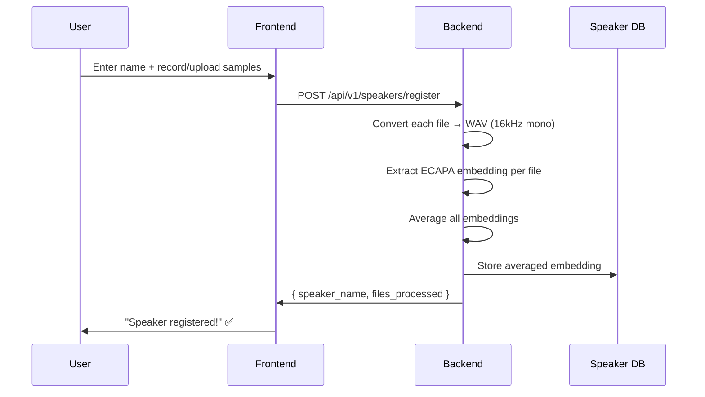
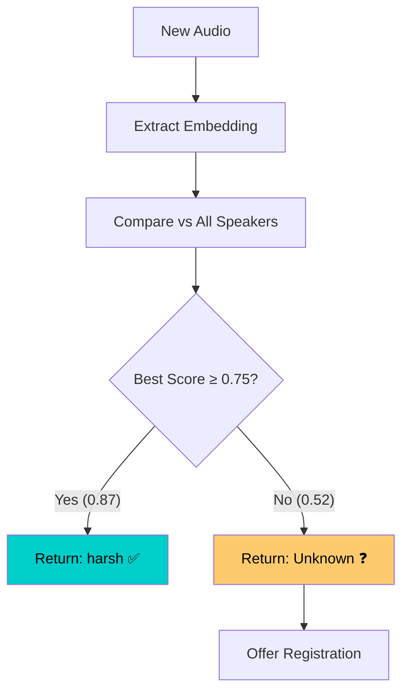

<div align="center">

# 🎙️ VoiceAuth

### Open-Set Hindi Speaker Recognition System

[](https://fastapi.tiangolo.com)
[](https://nextjs.org)
[](https://speechbrain.github.io)
[](https://pytorch.org)
[](LICENSE)

**Identify speakers · Detect unknowns · Register voices — all from Hindi audio.**

A web-based, embedding-driven speaker recognition system that uses deep neural network embeddings and cosine similarity to identify registered speakers, gracefully reject unknown voices, and dynamically onboard new speakers through the browser.

[Live Demo](#-demo) · [Getting Started](#-getting-started) · [API Reference](#-api-endpoints) · [Deploy](#-deployment)

---

<!-- Add your screenshots here -->
<!--  -->
<!--  -->

</div>

## 📖 Overview

VoiceAuth is a full-stack, open-set speaker recognition system purpose-built for **Hindi voice and conversation analysis**. Unlike closed-set classifiers that force every input into a known category, VoiceAuth uses an **embedding-based approach** — it compares voice fingerprints using cosine similarity and confidently says *"I don't know"* when the speaker isn't registered.

### What makes it different?

| Traditional Approach | VoiceAuth Approach |
|---|---|
| MFCC features + SVM classifier | Deep neural embeddings (ECAPA-TDNN) |
| Closed-set — always picks *someone* | Open-set — returns "Unknown" when unsure |
| Retrain model for every new speaker | Dynamic registration — no retraining |
| Fixed at training time | Grows at runtime via API |
| Offline pipeline | Full-stack web app with live mic input |

---

## 💡 Why This Project?

Speaker recognition is a critical building block in:

- **Forensic audio analysis** — who said what in a recording
- **Call center analytics** — identify callers without passwords
- **Meeting transcription** — attribute speech to participants
- **Voice-based access control** — biometric authentication

Most existing tools focus on English and require complex retraining workflows. VoiceAuth was built to demonstrate that a **lightweight, embedding-based system** can deliver real-time speaker identification for Hindi audio — with a clean UI, zero retraining, and a working demo you can run from your browser.

---

## 🏗 System Architecture



---

## 🔄 End-to-End Pipeline

```mermaid
graph LR
    A["🎤 Audio Input<br/>(Mic or File)"] --> B["📦 Upload<br/>(WebM / WAV / MP3)"]
    B --> C["🔄 ffmpeg Convert<br/>(→ 16kHz Mono WAV)"]
    C --> D["✂️ Chunking<br/>(10s segments)"]
    D --> E["🧠 ECAPA-TDNN<br/>(Extract Embeddings)"]
    E --> F["📐 Cosine Similarity<br/>(vs Speaker DB)"]
    F --> G{"Threshold<br/>Check"}
    G -->|"≥ 0.75"| H["✅ Speaker Identified"]
    G -->|"< 0.75"| I["❓ Unknown Speaker"]
    I --> J["📝 Register New Speaker"]
    J --> K["🔁 Add to Speaker DB"]

    style A fill:#6c5ce7,stroke:#a29bfe,color:#fff
    style H fill:#00cec9,stroke:#55efc4,color:#000
    style I fill:#fdcb6e,stroke:#ffeaa7,color:#000
    style J fill:#fd79a8,stroke:#fab1a0,color:#000
```



---

## 👤 User Flow



---

## ✨ Features

### Core
- 🎯 **Speaker Identification** — Match voices to registered speakers using deep embeddings
- ❓ **Unknown Detection** — Confidently reject unregistered voices instead of forced classification
- 📝 **Dynamic Registration** — Add new speakers via API without retraining any model
- ✂️ **Chunk-Based Analysis** — Long audio is split into 10-second segments for robust prediction
- 📊 **Aggregation Logic** — Weak chunks are discarded; final result uses highest average similarity

### Audio Handling
- 🎤 **Browser Mic Recording** — Record directly using MediaRecorder API
- 📁 **File Upload** — Support for WAV, MP3, FLAC, WebM, OGG, M4A
- 🔄 **Auto Conversion** — All formats converted to 16kHz mono WAV via ffmpeg
- 🛡️ **MIME Validation** — Rejects non-audio uploads at the gate

### Interface
- 🌑 **Dark Mode UI** — Polished, modern design with glassmorphism
- 📈 **Similarity Meter** — Visual progress bar showing match confidence
- 🏷️ **Known / Unknown Badges** — Instant visual status
- 📋 **Chunk Results** — Per-chunk breakdown with individual scores
- 📱 **Responsive** — Works on desktop and mobile browsers

---

## 🛠 Tech Stack

| Layer | Technology | Purpose |
|---|---|---|
| **Frontend** | Next.js 16, TypeScript | App Router, SSR-ready UI |
| **Styling** | CSS Modules, Inter font | Dark theme design system |
| **Backend** | FastAPI, Uvicorn | REST API server |
| **ML Model** | SpeechBrain ECAPA-TDNN | 192-dim speaker embeddings |
| **Inference** | PyTorch, Cosine Similarity | Embedding comparison |
| **Audio** | ffmpeg, librosa, soundfile | Format conversion & chunking |
| **Database** | Pickle (primary), SQLite (metadata) | Speaker embeddings & logs |
| **Deployment** | Render (backend), Vercel (frontend) | Cloud hosting |

---

## 📁 Project Structure

```
voice-auth-project/
├── backend/
│   ├── Dockerfile                 # Container config with ffmpeg
│   ├── render.yaml                # Render deployment config
│   ├── requirements.txt           # Python dependencies
│   ├── run.py                     # Server entrypoint
│   ├── models/
│   │   └── speaker_db.pkl         # Speaker embedding database
│   └── src/
│       ├── app.py                 # FastAPI app + CORS + lifespan
│       ├── config/
│       │   └── settings.py        # Pydantic settings from .env
│       ├── models/
│       │   ├── database.py        # SQLite setup (optional metadata)
│       │   └── schemas.py         # Pydantic response schemas
│       ├── routes/
│       │   ├── analysis_routes.py # POST /analyze
│       │   ├── speaker_routes.py  # POST /register, GET /speakers
│       │   └── health_routes.py   # GET /health
│       ├── services/
│       │   └── embedding_service.py  # Core ML logic
│       └── utils/
│           └── audio.py           # ffmpeg conversion + chunking
│
├── frontend/
│   ├── .env.local                 # NEXT_PUBLIC_API_URL
│   └── src/
│       ├── app/
│       │   ├── page.tsx           # Landing page
│       │   ├── globals.css        # Design system
│       │   └── analyze/
│       │       └── page.tsx       # Analysis page
│       ├── components/
│       │   ├── Navbar.tsx         # Top navigation
│       │   ├── AudioInput.tsx     # Mic recorder + file upload
│       │   ├── ResultPanel.tsx    # Prediction results
│       │   └── RegisterModal.tsx  # Speaker registration modal
│       ├── hooks/
│       │   └── useAudioRecorder.ts # MediaRecorder hook
│       ├── lib/
│       │   └── api.ts             # Backend API client
│       └── types/
│           └── api.ts             # TypeScript interfaces
│
└── scripts/                       # Data preparation & training scripts
```

---

## 📡 API Endpoints

### Health Check

```
GET /health
```

```json
{
  "status": "healthy",
  "speakers_loaded": 6,
  "model_ready": true
}
```

---

### Analyze Audio

```
POST /api/v1/analyze/
Content-Type: multipart/form-data
```

| Parameter | Type | Description |
|---|---|---|
| `file` | `File` | Audio file (WAV, MP3, WebM, etc.) |
| `threshold` | `float` (query, optional) | Similarity threshold (default: 0.75) |
| `chunk_duration` | `int` (query, optional) | Chunk size in seconds (default: 10) |

**Response:**

```json
{
  "filename": "recording.webm",
  "duration_sec": 23.5,
  "final_speaker": "harsh",
  "similarity": 0.8734,
  "is_known": true,
  "num_chunks": 3,
  "threshold_used": 0.75,
  "chunks": [
    {
      "chunk_index": 0,
      "start_sec": 0.0,
      "end_sec": 10.0,
      "speaker": "harsh",
      "similarity": 0.8812,
      "is_known": true
    },
    {
      "chunk_index": 1,
      "start_sec": 10.0,
      "end_sec": 20.0,
      "speaker": "harsh",
      "similarity": 0.8901,
      "is_known": true
    },
    {
      "chunk_index": 2,
      "start_sec": 20.0,
      "end_sec": 23.5,
      "speaker": "harsh",
      "similarity": 0.8490,
      "is_known": true
    }
  ]
}
```

**Unknown Speaker Response:**

```json
{
  "final_speaker": "Unknown",
  "similarity": 0.5123,
  "is_known": false,
  "threshold_used": 0.75
}
```

---

### Register Speaker

```
POST /api/v1/speakers/register
Content-Type: multipart/form-data
```

| Parameter | Type | Description |
|---|---|---|
| `speaker_name` | `string` (form) | Name of the speaker |
| `files` | `File[]` (form) | One or more audio samples |

**Response:**

```json
{
  "speaker_name": "priya",
  "files_processed": 3,
  "message": "Speaker 'priya' registered with 3 file(s)"
}
```

---

### List Speakers

```
GET /api/v1/speakers/
```

```json
{
  "count": 6,
  "speakers": [
    { "name": "harsh", "registered_at": "2026-04-19T10:30:00Z" },
    { "name": "Speaker_0001", "registered_at": null }
  ]
}
```

---

## 🧠 How the ML Pipeline Works

### Embedding Extraction

VoiceAuth uses **SpeechBrain's ECAPA-TDNN** model, pre-trained on VoxCeleb, to extract a compact **192-dimensional embedding vector** from each audio segment. This vector is a numerical "voice fingerprint" that captures the unique characteristics of a speaker's voice — independent of what words are spoken.

```
Audio Signal → ECAPA-TDNN Encoder → 192-dim Embedding Vector
```

### Cosine Similarity Matching

Each new audio embedding is compared against all stored speaker embeddings using **cosine similarity**:

```
                    A · B
similarity = ─────────────────
              ‖A‖ × ‖B‖
```

- **1.0** = identical voices
- **0.75+** = confident match (default threshold)
- **< 0.75** = not confident → marked as Unknown

### Aggregation Logic

For audio longer than 10 seconds:

1. Split into 10-second chunks
2. Extract embedding for each chunk
3. Compare each chunk against all speakers
4. **Discard weak chunks** (similarity < threshold)
5. Group remaining chunks by speaker
6. Pick speaker with **highest average similarity**

This prevents a single noisy chunk from corrupting the entire result.

---

## 📝 Speaker Registration Flow



- No retraining required — embeddings are computed on the fly
- Multiple samples improve accuracy (averaged embedding is more robust)
- Existing speakers can be updated with additional samples

---

## ❓ Unknown Speaker Detection

VoiceAuth implements **open-set recognition** — it will never force an unknown voice into a known category.



**Why this matters:**
- A closed-set SVM would pick the "least bad" match even at 30% confidence
- VoiceAuth says "I don't know" and offers to register the new voice
- Threshold is configurable per request (default: 0.75)

---

## 🚀 Getting Started

### Prerequisites

- **Python** 3.10+
- **Node.js** 18+
- **ffmpeg** (required for audio conversion)

```bash
# macOS
brew install ffmpeg

# Ubuntu/Debian
sudo apt install ffmpeg

# Verify
ffmpeg -version
```

### Backend Setup

```bash
# Clone the repo
git clone https://github.com/YOUR_USERNAME/voice-auth-project.git
cd voice-auth-project

# Create virtual environment
python3 -m venv venv
source venv/bin/activate  # Windows: venv\Scripts\activate

# Install dependencies
cd backend
pip install -r requirements.txt

# Configure environment
cp .env.example .env   # or edit .env directly

# Start the server
python run.py
# → http://localhost:8000
# → Swagger docs at http://localhost:8000/docs
```

### Frontend Setup

```bash
# In a new terminal
cd frontend

# Install dependencies
npm install

# Start dev server
npm run dev
# → http://localhost:3000
```

### Quick Test

```bash
# Health check
curl http://localhost:8000/health

# List speakers
curl http://localhost:8000/api/v1/speakers/

# Analyze audio
curl -X POST http://localhost:8000/api/v1/analyze/ \
  -F "file=@test_audio.wav"
```

---

## ⚙️ Environment Variables

### Backend (`backend/.env`)

| Variable | Default | Description |
|---|---|---|
| `HOST` | `0.0.0.0` | Server bind address |
| `PORT` | `8000` | Server port |
| `DEBUG` | `true` | Enable debug logging & hot reload |
| `SIMILARITY_THRESHOLD` | `0.75` | Minimum cosine similarity for a match |
| `CHUNK_DURATION_SEC` | `10` | Audio chunk length in seconds |
| `SPEAKER_DB_PATH` | `models/speaker_db.pkl` | Path to speaker database |
| `UPLOAD_DIR` | `uploads` | Temporary upload directory |
| `DATABASE_URL` | `sqlite:///./voice_auth.db` | SQLite URL (metadata only) |
| `CORS_ORIGINS` | `http://localhost:3000` | Allowed frontend origins (comma-separated) |

### Frontend (`frontend/.env.local`)

| Variable | Default | Description |
|---|---|---|
| `NEXT_PUBLIC_API_URL` | `http://localhost:8000` | Backend API base URL |

---

## 🌐 Deployment

### Backend → Render

The backend ships with a `Dockerfile` and `render.yaml` for one-click deployment.

1. Push repo to GitHub
2. [Render Dashboard](https://dashboard.render.com) → **New Web Service**
3. Connect repo → Root Directory: `backend` → Runtime: **Docker**
4. Set environment variables (see table above)
5. Add **Persistent Disk** mounted at `/app/models` (preserves `speaker_db.pkl`)
6. Deploy

> ⚠️ Use the **Starter plan** ($7/mo) — PyTorch needs ~1 GB RAM.

### Frontend → Vercel

1. [Vercel Dashboard](https://vercel.com/dashboard) → **New Project**
2. Import repo → Root Directory: `frontend`
3. Set `NEXT_PUBLIC_API_URL` = your Render URL
4. Deploy — done in ~60 seconds

Then update `CORS_ORIGINS` on Render with your Vercel URL.

---

## 🎬 Demo

1. Open the app → **Landing Page** explains the project
2. Click **"Get Started"** → navigate to the analysis page
3. **Record** your voice using the mic (10+ seconds for best results) or **upload** a file
4. Click **"Analyze"** → see the prediction with similarity score and chunk breakdown
5. If you're a new speaker → click **"Register Speaker"**, add your name and samples
6. Analyze again → you should now be recognized ✅

> **Tip:** For the best demo, register 2–3 speakers with 3+ samples each, then analyze mixed or individual recordings.

---

## ⚠️ Limitations

| Limitation | Details |
|---|---|
| **Language scope** | Trained and tested primarily on Hindi audio |
| **Background noise** | Performance degrades in noisy environments |
| **Short audio** | Segments under 3 seconds may produce unreliable embeddings |
| **Speaker DB** | Stored locally as a pickle file — not suitable for large-scale production |
| **Single channel** | Does not perform speaker diarization (who spoke when) |
| **Cold start** | First request downloads the SpeechBrain model (~80 MB) |

## 🔮 Future Scope

- [ ] Speaker diarization — identify multiple speakers in a single conversation
- [ ] Real-time streaming analysis via WebSockets
- [ ] Vector database (Pinecone / Milvus) for scalable speaker storage
- [ ] Multi-language support (English, Tamil, Bengali)
- [ ] Speaker verification mode (1:1 confirmation)
- [ ] Voice activity detection to skip silence
- [ ] Admin dashboard for managing speakers

---

## 🙏 Acknowledgements

| Resource | Use |
|---|---|
| [SpeechBrain](https://speechbrain.github.io) | ECAPA-TDNN pre-trained model |
| [VoxCeleb](https://www.robots.ox.ac.uk/~vgg/data/voxceleb/) | Pre-training dataset for the embedding model |
| [FastAPI](https://fastapi.tiangolo.com) | Backend framework |
| [Next.js](https://nextjs.org) | Frontend framework |
| [FFmpeg](https://ffmpeg.org) | Audio format conversion |
| [librosa](https://librosa.org) | Audio loading and processing |

---

<div align="center">

**Built with 🎯 for accurate speaker recognition**

</div>
